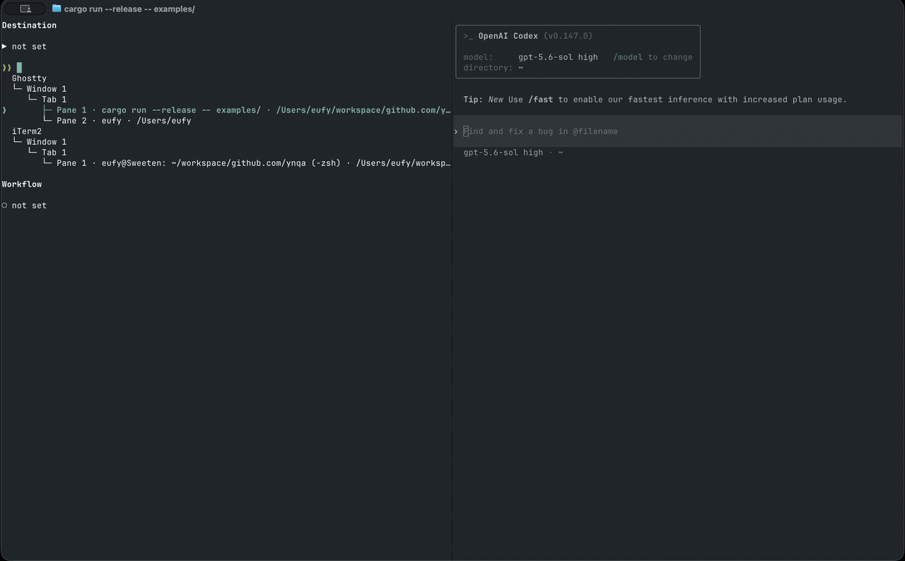

# convey

[English](README.md) | 日本語

Convey は、繰り返し作成するプロンプトを対話的なターミナルワークフローに変換します。収集したい情報を YAML で定義し、キーボードで操作できるインターフェースから値を入力して、生成した Markdown を選択したターミナルペインへ直接送信できます。

決まった構造を持ちながら、実行時のローカル環境に依存するプロンプトに適しています。例えば、エージェントに調査を依頼する前に Kubernetes の context、namespace、resource を選択する用途があります。



## 開発の動機

私は普段、Kubernetes 環境で起きた問題の調査を Claude や Codex に依頼しています。例えば、Grafana で異常に気づいたときに、`CrashLoopBackOff` になっている Pod の原因を調べてもらう、といった具合です。

調査を始めてもらうには、単に「この Pod を調べて」と伝えるだけでは足りません。どの `context` の、どの `namespace` にある、どの `kind` の、どの Pod なのかを指定する必要があります。これらはエージェントに推測してほしい情報ではなく、調査を依頼する自分が決めたい情報です。

しかし対象が変わるたびに、`kubectl` で `context`、`namespace`、resource kind、Pod 名を順番に確認し、それぞれをコピーして、ほぼ同じ構造の prompt に埋め直していました。ひとつひとつは小さな操作でも、調査を依頼するたびに繰り返すと面倒です。別の `context` や `namespace` を貼り付ける可能性もあり、エージェントが調査を始める前の入力作業がボトルネックになっていました。

ローカル環境に存在する値をその場で一覧にして、必要なものを順番に選び、いつもの依頼文へ埋め込んで、そのまま起動中のエージェントへ渡せたら便利なのに、と何度も感じていました。調査対象の決定は自分で行いながら、その決定を prompt に転記する作業だけをなくしたかったのです。

Convey は、この不便を解消するために作りました。毎回変わる値を入力項目として、変わらない依頼の構造を YAML workflow として定義し、エージェントが調査を始めるまでの最初の入力をスムーズにします。

## `SKILL.md` との違い

`SKILL.md` でも、必要な値をユーザーに確認するようエージェントへ指示できます。ただし、それはモデルへの指示であり、必須の選択が常に実行されることを保証するものではありません。

Convey は、エージェントに判断させたくない値をユーザーが選択するまで、依頼を送信しません。必要な人間の意思決定を、エージェントへ届く前に確実に行うためのゲートです。

## 機能

- `select` と複数行の `textarea` を使用した YAML 定義のフォーム
- 固定された選択肢、またはローカルコマンドから動的に取得する選択肢
- 上流の値が変更されたときに再読み込みされる依存入力
- Markdown を生成する Handlebars テンプレート
- 必須入力と任意入力の検証
- ターミナルアプリケーション、window、tab、pane を検索できるツリー
- ディレクトリからのワークフロー選択、またはワークフローファイルの直接起動
- 送信先、ワークフロー、入力項目、選択候補を横断するシームレスなキーボード操作
- Ghostty、iTerm2、tmux のペインへの直接送信
- 候補取得コマンドや送信先取得に失敗した場合のエラー表示と再試行

## 必要な環境

- 次のいずれかの送信先
  - `tmux` コマンドを利用できるプラットフォーム上の tmux
  - macOS 上の Ghostty または iTerm2
- Ghostty と iTerm2 では、macOS Automation の確認が表示されたときに、使用中のターミナルが送信先アプリケーションを操作する権限
- `kubectl` など、ワークフローの候補取得コマンドで使用するプログラム

現在対応している送信先は Ghostty、iTerm2、tmux です。tmux 連携は `tmux` コマンドを直接呼び出すため、プラットフォーム固有のアプリケーション操作を必要としません。

## インストール

Homebrew tap から Convey をインストールできます。

```console
$ brew install ynqa/tap/convey
```

ソースからビルドする場合は、Rust 1.85 以降をインストールして次を実行します。

```console
$ cargo install --git https://github.com/ynqa/convey.git --locked
```

## クイックスタート

```console
$ git clone https://github.com/ynqa/convey.git
$ convey --terminal ghostty convey/examples
```

iTerm2 または tmux を使用する場合は、`ghostty` を `iterm2` または `tmux` に置き換えてください。入力画面では、送信先のペイン、`convey/examples` に含まれる YAML ファイル、各入力項目の値を順番に選択し、生成した Markdown を送信できます。

1つのワークフローを直接起動することもできます。この場合もワークフローセレクターは画面に残りますが、指定したファイルが最初から選択されています。

```console
$ convey --terminal ghostty convey/examples/kubernetes-investigation.yaml
```

位置引数の `WORKFLOW` には、ワークフローファイルまたはディレクトリを指定できます。ディレクトリモードでは、そのディレクトリ直下にある `.yaml` と `.yml` ファイルが一覧表示されます。

### ターミナルアプリケーションの選択

Convey が問い合わせるアプリケーションは、`-t` または `--terminal` で指定できます。

```console
$ convey --terminal ghostty examples
$ convey --terminal iterm2 examples
$ convey --terminal tmux examples
$ convey --terminal ghostty,iterm2 examples
```

デフォルトでは、対応しているすべてのアプリケーションが対象です。実際に使用するアプリケーションを指定すると、利用できないアプリケーションへの問い合わせを避けられます。

## 入力画面の仕組み

画面は、連続した3つのセクションで構成されています。

1. **Destination** — 結果を受け取るターミナルペイン
2. **Workflow** — 実行する YAML 定義
3. **Input fields** — ワークフローの生成に使用する入力値

各セクションまたは入力項目の状態は、次の記号で表されます。

- `▶` フォーカス中
- `✓` 保存済み
- `○` 未入力

各セレクターを独立した操作対象として扱うのではなく、候補やセクションの境界を越えて連続的に移動できます。境界を越えると、現在の値が保存されます。

| キー | 操作 |
| --- | --- |
| `Tab` または `Down` | 次の候補、textarea の行、入力項目、セクションへ移動します |
| `Shift+Tab` または `Up` | 前の候補、textarea の行、入力項目、セクションへ移動します |
| `Enter` | 現在の送信先、ワークフロー、select の値を保存して次へ進みます |
| textarea 内の `Enter` | 改行を挿入します |
| textarea 内の `Ctrl+Enter` | textarea を保存して次へ進みます |
| `Ctrl+S` | フォーカス中の値を保存し、必須入力を検証して送信した後、フォームをリセットします |
| `Ctrl+R` | 送信先を更新するか、失敗した候補取得コマンドを再実行します |
| `Ctrl+G` | ヘルプ画面を開く、または閉じます |
| `Esc` | ヘルプ画面から戻るか、入力画面をキャンセルします |
| `Ctrl+C` | キャンセルします |

マウスを使用してセクションをフォーカスしたり、編集カーソルを移動したり、表示中の候補を選択したりすることもできます。

必須入力が空でも画面内の移動は妨げられません。`Ctrl+S` で送信するときに検証され、最初に不足している値へフォーカスが移動します。

select の検索に一致する候補がない場合、`Enter` を押すと、空でない検索文字列がカスタム値として保存されます。

### 送信先の検索

Destination にフォーカスがある状態で文字を入力すると、ターミナルツリーが絞り込まれます。修飾子のない検索語は、アプリケーション、pane name、working directory、pane location を対象に検索されます。複数の検索語は AND 条件として扱われます。

特定の属性を検索する場合は修飾子を指定します。

| Qualifier | Property |
| --- | --- |
| `app:` | Terminal application |
| `name:` | Pane name |
| `cwd:` または `path:` | Working directory |
| `w:` または `window:` | Window index |
| `t:` または `tab:` | Tab index |
| `p:` または `pane:` | Pane index |
| `id:` | アプリケーション固有の pane identifier |

空白を含む値は引用符で囲みます。

```text
app:ghostty cwd:/workspace name:"Claude Code"
```

一致しないペインも薄く表示されたまま残ります。これにより、一致したペインが所属するアプリケーション、window、tab の構造を確認できます。

## ワークフローの記述

ワークフローには、表示名、順序付きの入力 map、出力テンプレートを定義します。

```yaml
name: incident-summary

inputs:
  environment:
    type: select
    candidates:
      values: [development, staging, production]

  request:
    type: textarea
    allow_empty: false

output:
  template: |
    # Incident request

    - Environment: `{{ inputs.environment }}`

    {{ inputs.request }}
```

入力項目は YAML に記述した順番で表示されます。ワークフローには、1つ以上の入力項目と空でない出力テンプレートが必要です。

### 入力タイプ

#### `textarea`

自由記述の複数行入力には textarea を使用します。

```yaml
request:
  type: textarea
  allow_empty: false
```

デフォルトでは、入力項目に空の値を指定できます。送信時に値を必須とするには `allow_empty: false` を設定します。

#### 固定候補を持つ `select`

固定された候補は `candidates.values` で定義します。

```yaml
priority:
  type: select
  candidates:
    values: [low, medium, high]
```

#### コマンドから候補を取得する `select`

ローカルプログラムから候補を取得する場合は、`candidates.command` を使用します。

```yaml
context:
  type: select
  candidates:
    command:
      program: kubectl
      args: [config, get-contexts, -o, name]
```

Convey は shell を介さずにプログラムを直接実行します。UTF-8 の標準出力に含まれる空でない各行が1つの候補になります。終了ステータスが0以外の場合、エラーはフォーム内に表示され、`Ctrl+R` で再実行できます。

### 依存する候補

コマンドから候補を取得する select は、それ以前に保存された入力値に依存できます。テンプレート式は、実行するプログラムと引数の両方で使用できます。

```yaml
namespace:
  type: select
  depends_on: [context]
  candidates:
    command:
      program: kubectl
      args:
        - --context
        - "{{ inputs.context }}"
        - get
        - namespaces
        - -o
        - 'jsonpath={range .items[*]}{.metadata.name}{"\n"}{end}'
```

すべての依存値が保存されるまで、コマンドは実行されません。上流の値を変更すると、影響を受けるすべての下流 select がクリアされ、候補が再取得されます。依存先には、それ以前に定義された入力項目だけを指定できます。textarea に依存関係を定義することはできません。

### 出力テンプレート

`output.template` は Handlebars で生成されます。収集した値には `inputs.<name>` でアクセスします。

```yaml
output:
  template: |
    Investigate `{{ inputs.resource }}` in `{{ inputs.namespace }}`.

    {{ inputs.request }}
```

値が設定されていない任意入力は、空文字列として出力されます。生成されたテキストは HTML escape されず、Markdown として出力されます。

コマンドから候補を取得する複数の依存入力を含む完全なワークフローの例は、[`examples/kubernetes-investigation.yaml`](examples/kubernetes-investigation.yaml) を参照してください。

## 送信と安全性

`Ctrl+S` で送信すると、生成されたテキストが選択したペインに送られ、その後、別の automation 操作として Enter が送信されます。送信に成功すると、Convey は新しい入力画面へ戻り、続けて別のメッセージを作成できます。

送信先が shell の場合、生成されたテキストがコマンドとして実行される可能性があります。送信前に、選択したペインとワークフローの内容を確認してください。

候補取得プログラムは、Convey と同じユーザー権限でローカル実行されます。Convey は shell を介さずにプログラムを起動しますが、実行ファイルと引数はワークフローの作成者が制御できます。信頼できる提供元のワークフローだけを使用してください。

## 開発

変更を提出する前に、formatter、test、lint を実行します。

```console
$ cargo fmt --check
$ cargo test
$ cargo clippy --all-targets -- -D warnings
```

Ghostty と iTerm2 の連携は、`src/automation/ghostty` と `src/automation/iterm2` にある独立した AppleScript として実装されています。送信先の検出や送信処理を debug する場合は、`osascript` を使用して直接実行できます。プラットフォーム共通の tmux 連携は `src/automation/tmux` にあり、`tmux` CLI を直接呼び出します。

### リリース

生成されたリリースワークフローは、`v0.1.0` のような version tag が push されたときに、macOS の両 architecture 向け binary をビルドし、Homebrew Formula を `ynqa/homebrew-tap` へ公開します。repository には、その tap への書き込み権限を持つ `HOMEBREW_TAP_TOKEN` Actions secret を設定する必要があります。
